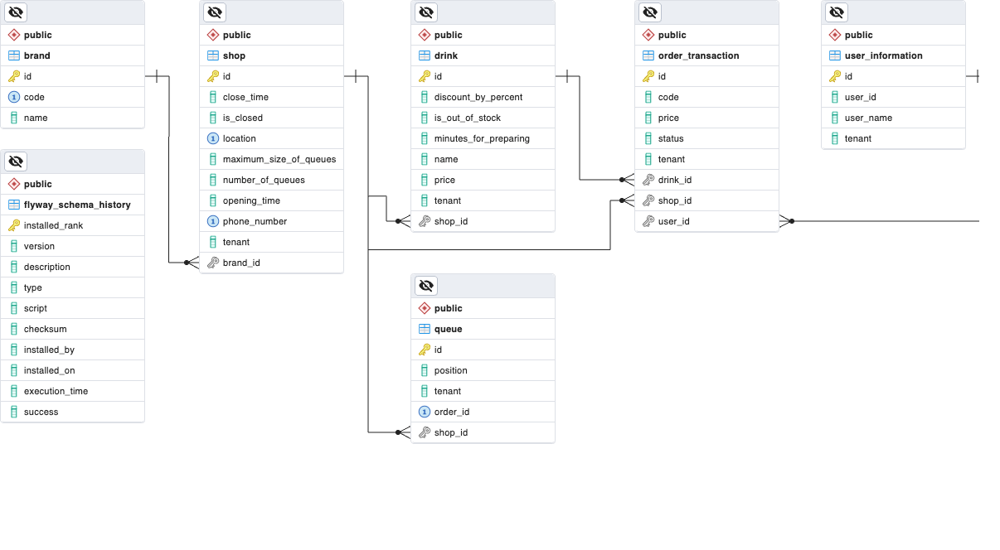

## Database diagram


## Swagger Specification
Please refer to the link : [Swagger](http://localhost:9092/swagger-ui/index.html#/)

## How to run
```
docker-compose -f docker/docker-compose.yaml up -d
```

## Testing
Sorry, I'm busy this week and don't have enough time to do the challenge.
So, I just support to order one item.

### Customer orders drink
#### Testing data

| Tenant    | Drink Id                              |
|-----------|---------------------------------------|
| TD        | aeb790cb-b0e5-490b-b0d1-18bd36193901  |
| TD        | aeb790cb-b0e5-490b-b0d1-18bd36193902  |
| TD        | aeb790cb-b0e5-490b-b0d1-18bd36193903  |
| TD        | aeb790cb-b0e5-490b-b0d1-18bd36193904  |
| TD        | aeb790cb-b0e5-490b-b0d1-18bd36193905  |
| TD        | aeb790cb-b0e5-490b-b0d1-18bd36193906  |
| TD        | aeb790cb-b0e5-490b-b0d1-18bd36193907  |
| TD        | aeb790cb-b0e5-490b-b0d1-18bd36193908  |
| TD        | aeb790cb-b0e5-490b-b0d1-18bd36193909  |
| TD        | aeb790cb-b0e5-490b-b0d1-18bd361939010 |
| Highlands | aeb790cb-b0e5-490b-b0d1-18bd36193911  |
| Highlands | aeb790cb-b0e5-490b-b0d1-18bd36193912  |
| Highlands | aeb790cb-b0e5-490b-b0d1-18bd36193913  |
| Highlands | aeb790cb-b0e5-490b-b0d1-18bd36193914  |
| Highlands | aeb790cb-b0e5-490b-b0d1-18bd36193915  |
| Highlands | aeb790cb-b0e5-490b-b0d1-18bd36193916  |
| Highlands | aeb790cb-b0e5-490b-b0d1-18bd36193917  |
| Highlands | aeb790cb-b0e5-490b-b0d1-18bd36193918  |
| Highlands | aeb790cb-b0e5-490b-b0d1-18bd36193919  |
| Highlands | aeb790cb-b0e5-490b-b0d1-18bd36193920  |
| PL        | aeb790cb-b0e5-490b-b0d1-18bd36193921  |
| PL        | aeb790cb-b0e5-490b-b0d1-18bd36193922  |
| PL        | aeb790cb-b0e5-490b-b0d1-18bd36193923  |
| PL        | aeb790cb-b0e5-490b-b0d1-18bd36193924  |
| PL        | aeb790cb-b0e5-490b-b0d1-18bd36193925  |
| PL        | aeb790cb-b0e5-490b-b0d1-18bd36193926  |
| PL        | aeb790cb-b0e5-490b-b0d1-18bd36193927  |
| PL        | aeb790cb-b0e5-490b-b0d1-18bd36193928  |
| PL        | aeb790cb-b0e5-490b-b0d1-18bd36193929  |
| PL        | aeb790cb-b0e5-490b-b0d1-18bd36193930  |

#### CURL
```aidl
curl --location --request POST 'http://localhost:9092/v1/customer/drinks/aeb790cb-b0e5-490b-b0d1-18bd36193901/order' \
--header 'tenant: TD'
```

### Customer cancels an order
Customer will receive a code when ordering. They can use it to cancel WAITING order.
#### CURL
```aidl
curl --location --request POST 'http://localhost:9092/v1/customer/orders/YoctRX/cancel' \
--header 'tenant: TD'
```

### Owner views list of items in queue
#### Testing data

| Tenant    | Shop Id                              |
|-----------|--------------------------------------|
| TD        | b605ded5-e609-437d-bc7c-fbfa31889531 |
| TD        | 5bf7ba7f-add9-4852-9ade-0674ead0c952 |
| Highlands | 766b5bfe-1e02-451e-af14-8023e561c41b |
| Highlands | aeb790cb-b0e5-490b-b0d1-18bd361939f0 |
| PL        | c6e33bb4-3771-471e-b990-7c2c435f26d1 |
| PL        | 542f7824-572d-458e-9659-257f053fc69a |

#### CURL
```aidl
curl --location --request GET 'http://localhost:9092/v1/owner/shops/b605ded5-e609-437d-bc7c-fbfa31889531/orders' \
--header 'tenant: TD'
```

### Note
There are some APIs that can be used when needed. Please refer to swagger specification to see.